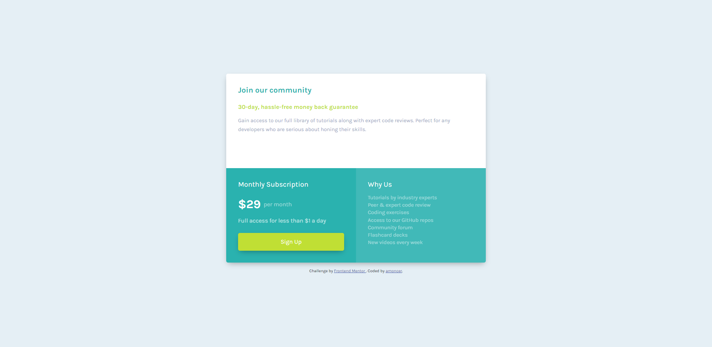

# Frontend Mentor - Single price grid component solution

This is a solution to the [Single price grid component challenge on Frontend Mentor](https://www.frontendmentor.io/challenges/single-price-grid-component-5ce41129d0ff452fec5abbbc). Frontend Mentor challenges help you improve your coding skills by building realistic projects.

## Table of contents

- [Overview](#overview)
  - [The challenge](#the-challenge)
  - [Screenshot](#screenshot)
  - [Links](#links)
- [My process](#my-process)
  - [Built with](#built-with)
  - [What I learned](#what-i-learned)
  - [Continued development](#continued-development)
- [Author](#author)

## Overview

### The challenge

Users should be able to:

- View the optimal layout for the component depending on their device's screen size
- See a hover state on desktop for the Sign Up call-to-action

### Screenshot



### Links

- Solution URL: [Add solution URL here](https://github.com/amoncer/fm-single-price-grid-component)
- Live Site URL: [Add live site URL here](https://amoncer-single-price-grid-component.netlify.app)

## My process

### Built with

- Semantic HTML5 markup
- CSS
- Flexbox
- CSS Grid
- Mobile-first workflow

### What I learned

It's the first time i work with `grid-template-areas`, and it's pretty.

See code snippet below :

```html
<div class="main">
  <section class="section-join"></section>
  <section class="section-subscription"></section>
  <section class="section-why"></section>
</div>
```

```css
.main {
  display: grid;
  grid-template-columns: 1fr 1fr;
  grid-template-rows: 1fr 1fr;
  grid-template-areas:
    "join join"
    "subscription why";
  max-width: 700px;
}

.section-join {
  grid-area: join;
}

.section-subscription {
  grid-area: subscription;
}

.section-why {
  grid-area: why;
}
```

### Continued development

I'm still not comfortable with layouts and spacing (containers, margin, padding, display...), i need to focus on these topics to be more efficient.

## Author

- Frontend Mentor - [@amoncer](https://www.frontendmentor.io/profile/amoncer)
